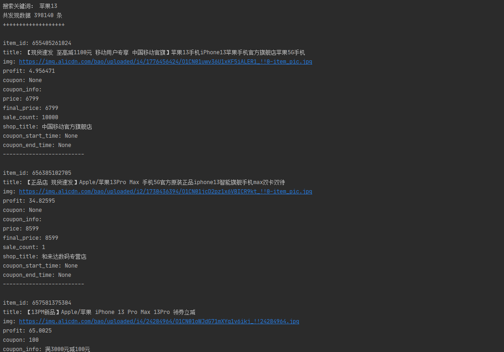

# taobao_search_interface
淘宝、拼多多、唯品会、美团、饿了么等app搜索接口。

最近在研究一款app的架构，无意中发现app中集成了一些电商接口，将接口和接入方法拎出来单独使用，发现用起来还挺好用的。

主要接口有淘宝、拼多多、唯品会、美团、饿了么。

主要功能是用于搜索商品及优惠信息，比如淘宝，可以搜索到的商品信息包括常见的ID，标题，价格，以及优惠券信息，券后价格等等。

何以为证，唯有截图：

